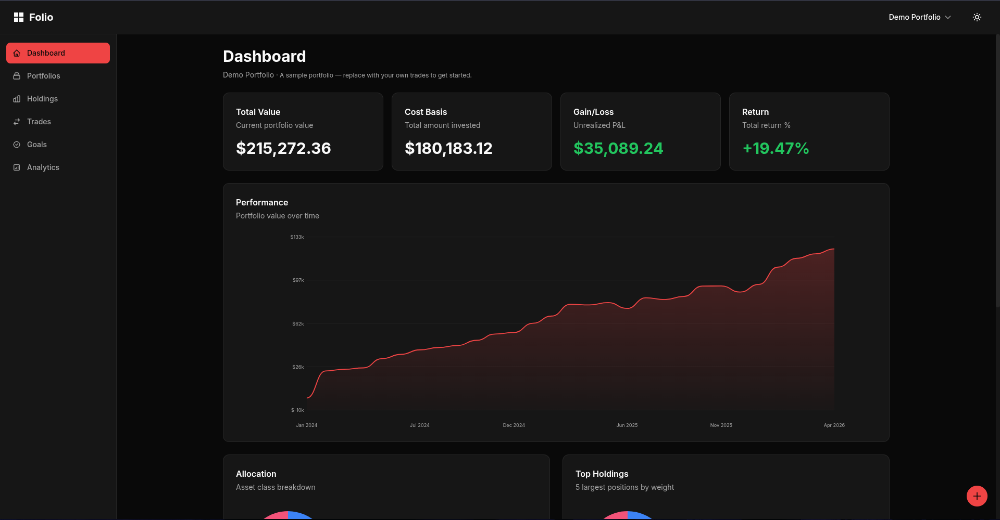
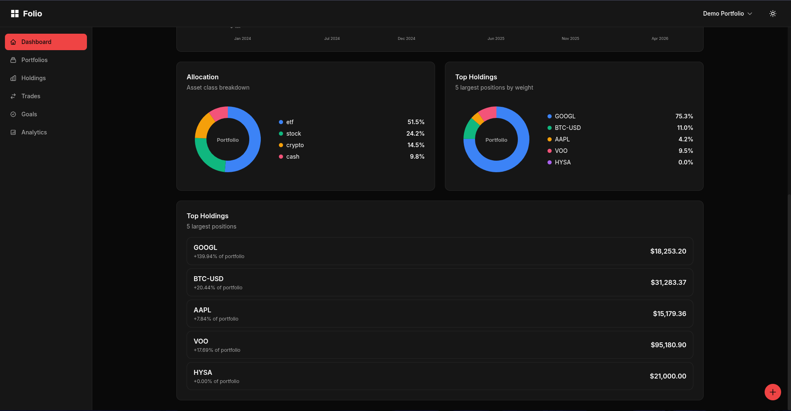

# Folio

A self-hosted investment tracking platform for managing portfolios, analyzing performance, and tracking financial goals.

> **Disclaimer:** This is a personal vibe-coded project and my second public attempt at vibe coding. The current implementation may not reflect best practices in architecture or code design, that's intentional for now. A refactor is planned in the coming weeks to address that, given that my intentions for this project is to make use of it as my own portfolio tracking tool.

## Features

**Portfolio Management**
- Multi-portfolio support with trade history (buy, sell, dividend, fee)
- Holdings tracking with live market data via yfinance
- Asset classes: stocks, ETFs, crypto, and cash
- CSV import with column mapping, validation, and error reporting
- Multi-currency support with automatic FX conversion

**Analytics**
- Time-weighted return (TWR) and money-weighted return (MWR)
- Asset allocation breakdown by class and sector
- Portfolio performance history and contribution charts

**Goal Tracking**
- Financial goals with target dates and expected return inputs
- FIRE projection calculations
- Visual progress tracking

## Preview





## Stack

| Layer    | Technology                        |
|----------|-----------------------------------|
| Frontend | SvelteKit, TypeScript, Tailwind, shadcn-svelte, bits-ui |
| Backend  | FastAPI, SQLAlchemy (async)       |
| Database | PostgreSQL                        |
| Data     | yfinance                          |
| Infra    | Docker, Docker Compose            |

## Getting Started

**Requirements:** Docker and Docker Compose.

```bash
git clone https://github.com/yourusername/folio.git
cd folio
make setup
make up
make db-migrate
```

Once running:

| Service  | URL                        |
|----------|----------------------------|
| Frontend | http://localhost:3000      |
| API      | http://localhost:8000      |
| API Docs | http://localhost:8000/docs |

To seed the database with demo data (stocks, crypto, and cash positions):

```bash
make db-seed
```

## Make Commands

### Infrastructure

| Command        | Description                        |
|----------------|------------------------------------|
| `make setup`   | Create `.env` files from examples  |
| `make up`      | Start all services                 |
| `make down`    | Stop all services                  |
| `make restart` | Restart all services               |
| `make logs`    | Stream logs from all services      |
| `make health`  | Check service health status        |
| `make clean`   | Remove containers and prune system |

### Database

| Command           | Description                        |
|-------------------|------------------------------------|
| `make db-migrate` | Run pending Alembic migrations     |
| `make db-seed`    | Seed demo portfolio data           |
| `make db-reset`   | Drop and recreate schema           |
| `make db-shell`   | Open PostgreSQL shell              |

### Development

| Command           | Description                        |
|-------------------|------------------------------------|
| `make api-shell`  | Shell into the API container       |
| `make api-lint`   | Lint Python code                   |
| `make api-format` | Format with black and isort        |
| `make api-test`   | Run API tests                      |
| `make web-shell`  | Shell into the web container       |
| `make web-lint`   | Lint TypeScript/Svelte code        |
| `make web-build`  | Build the production frontend      |

## License

[GNU GPL v2](LICENSE)
